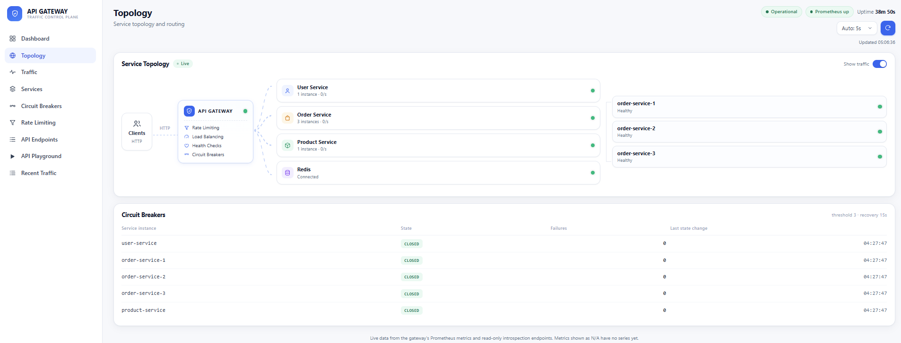
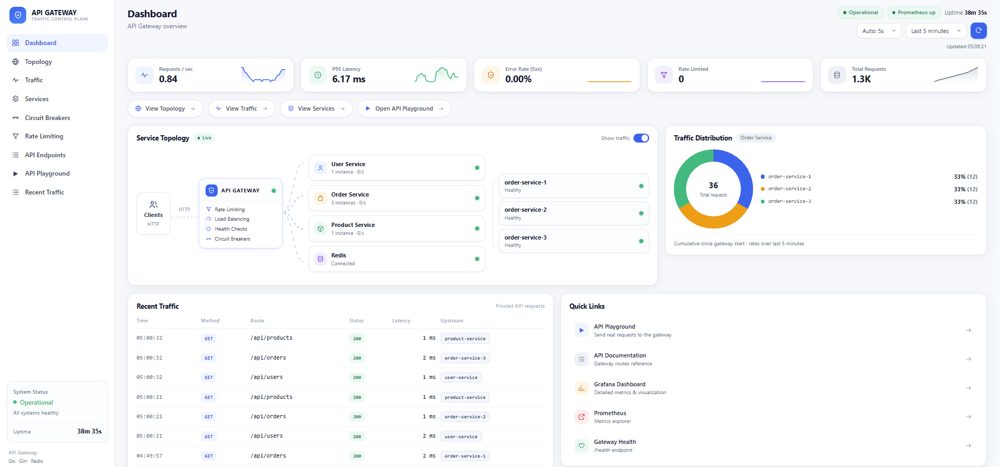
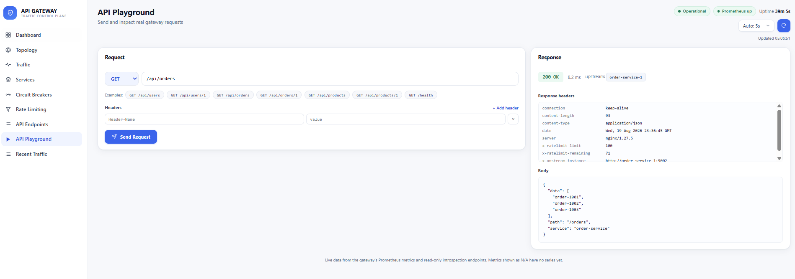
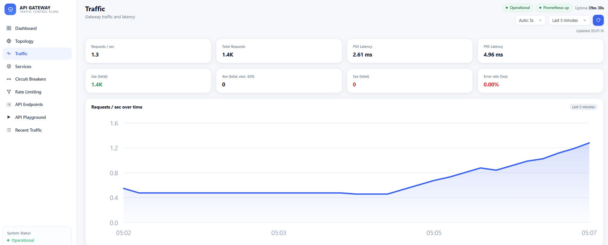
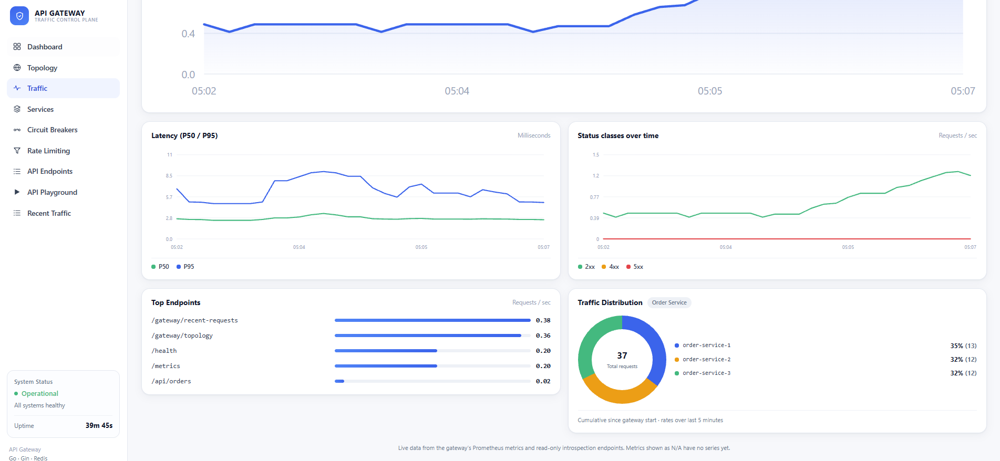

# API Gateway & Service Mesh Lite

**Go · Redis · Docker · Prometheus · Grafana · React**

A lightweight API Gateway and service-mesh-style infrastructure layer for a microservice architecture, with a live dashboard for observing and testing it.

It provides:

- Request routing (reverse proxy to backend services)
- Load balancing (round-robin across multiple instances of a service)
- Health-aware routing (unhealthy instances automatically removed from rotation)
- Redis-backed rate limiting (atomic, per-client)
- Circuit breakers (per-instance failure isolation)
- Observability (Prometheus metrics + Grafana dashboard)
- A React dashboard with live topology, traffic analytics, and an API request playground
- Service health monitoring across all backends

## Architecture & Service Topology

```
Client
  │
  ▼
API Gateway (Go + Gin)
  ├── Rate Limiter     (Redis, atomic Lua script)
  ├── Load Balancer    (round-robin registry)
  ├── Health Checker   (background probes)
  └── Circuit Breaker  (per-instance state machine)
  │
  ├──▶ User Service
  ├──▶ Order Service ×3   (order-service-1 / -2 / -3)
  └──▶ Product Service

Gateway ──▶ Prometheus ──▶ Grafana

React Dashboard ──▶ API Gateway   (topology, metrics, recent traffic)
                ──▶ Prometheus    (time-series queries, via same-origin proxy)
```

The gateway tracks backend instances in a lightweight per-service registry. A background health checker probes each instance's `/health` endpoint and excludes unhealthy ones from routing. Each instance also has its own circuit breaker (`CLOSED → OPEN → HALF-OPEN`) that trips independently on repeated upstream failures.



The topology view visualizes the gateway, its backend services, the individual order-service instances (order-service-1/2/3), and their live health and routing state.

## Features

| Feature | Implementation |
|---|---|
| Routing | Go/Gin reverse proxy |
| Load balancing | Round-robin service registry |
| Health-aware routing | Background health checker |
| Rate limiting | Redis + atomic Lua script |
| Circuit breaker | Per-instance state machine (CLOSED / HALF-OPEN / OPEN) |
| Observability | Prometheus metrics + Grafana dashboard |
| Dashboard | React + Vite |
| API Playground | Real requests sent through the running gateway |
| Containerization | Docker Compose |

## Dashboard



The dashboard provides a high-level view of gateway health, traffic, latency, service status, and overall system activity at a glance.

A multi-page React dashboard (client-side routed, no full page reloads) served at **http://localhost:8090**:

| Route | Page |
|---|---|
| `/` | Overview: KPIs, compact topology, compact traffic, quick links |
| `/topology` | Full service topology + circuit breaker states |
| `/traffic` | Requests/sec, P50/P95 latency, 2xx/4xx/5xx over time, top routes |
| `/services` | Per-instance backend health (including order-service-1/2/3 individually) |
| `/circuit-breakers` | Per-instance breaker state, failure counts, last state change |
| `/rate-limiting` | Configured limit/window, live usage, blocked requests over time |
| `/endpoints` | Available gateway routes grouped by service, with live stats |
| `/playground` | Send real HTTP requests through the gateway |
| `/recent-traffic` | Filterable log of recent proxied requests |

All numbers shown are backed by real data — Prometheus metrics or the gateway's own read-only introspection endpoints (`/gateway/topology`, `/gateway/recent-requests`). Where a metric has no data yet, the dashboard shows `N/A` rather than a fabricated value.

### API Playground



The **API Playground** is an interactive feature of the running application — not a mock. It sends actual `GET`/`POST`/`PUT`/`DELETE` requests through the gateway and displays the real HTTP status, response time, upstream instance that served the request, response headers, and formatted JSON body.

## 5-minute demo

1. Open the dashboard: `http://localhost:8090`
2. Open **API Playground** (`/playground`)
3. Send `GET /api/orders`
4. Note the `upstream` instance shown in the response (e.g. `order-service-2`)
5. Send it a few more times — the upstream instance changes, showing round-robin distribution
6. Stop one instance: `docker stop order-service-2`
7. Open **Services** or **Topology** — the instance shows as unhealthy, and traffic keeps flowing through the other two
8. Restart it: `docker start order-service-2` — it rejoins rotation within a few seconds
9. Open **Rate Limiting** (`/rate-limiting`)
10. Send enough requests to exceed the configured limit (100/60s by default)
11. See `429` responses and the blocked-request count update
12. Open **Circuit Breakers** (`/circuit-breakers`) to see per-instance failure counts and state

## Quick start

```
copy .env.example .env
docker compose up -d --build
```

| Service | URL |
|---|---|
| Dashboard | http://localhost:8090 |
| Gateway | http://localhost:8081 |
| Prometheus | http://localhost:9090 |
| Grafana | http://localhost:3000 (admin/admin) |

The gateway container listens on port 8080 internally but is published on host port 8081 (chosen to avoid clashing with other local services commonly bound to 8080).

Verify the gateway directly:

```
curl http://localhost:8081/health
curl http://localhost:8081/api/users
curl http://localhost:8081/api/orders
curl http://localhost:8081/api/products
```

## Performance / QA

Verified against a running Docker Compose stack (see `QA_RESULTS.md` for full detail):

- `go test ./...` and `go test -race ./...` — pass across all packages, no data races
- Frontend `tsc -b && vite build` — passes under TypeScript strict mode
- Full Docker stack health — all 10 containers (gateway, dashboard, redis, user/order×3/product services, prometheus, grafana) report `healthy` after a clean `docker compose down && up -d --build`
- Rate-limit concurrency test — 300 requests at 50 concurrent workers against a 100-request limit produced exactly 100 successes and 200 `429`s, confirming the Redis Lua script prevents the limit from being exceeded under concurrency
- Load-balancing test — 90 requests across 3 order-service instances split evenly 30/30/30, measured from live gateway logs
- Failure/recovery test — stopping `order-service-2` kept 100% request success (rerouted to the remaining 2 instances); restarting it restored the even 30/30/30 split
- Circuit breaker test — observed real `CLOSED → OPEN → HALF-OPEN → CLOSED` transitions against the live gateway, confirmed via the `gateway_circuit_breaker_state` metric
- Concurrent load test — 400 requests at 100 concurrent workers, 0 errors, ~2160 req/sec observed client-side throughput

## Project structure

```
cmd/                  entrypoints: gateway, user-service, order-service, product-service
internal/
  circuitbreaker/      per-instance CLOSED/OPEN/HALF-OPEN state machine
  config/              environment-variable configuration
  healthcheck/         background instance health probing
  metrics/             Prometheus metric definitions
  middleware/          Gin middleware (logging, metrics, rate limiting)
  proxy/               reverse proxy + load-balanced proxy
  ratelimit/           Redis-backed atomic rate limiter
  registry/            service registry (round-robin + health + breaker)
  router/              route wiring, including read-only introspection endpoints
  telemetry/           bounded ring buffer of recent proxied requests
frontend/              React + Vite dashboard (nginx-served)
  src/pages/           one component per dashboard route
  src/components/      shared UI (topology diagram, charts, tables)
  src/lib/             Prometheus + gateway API clients
monitoring/
  prometheus/          scrape configuration
  grafana/provisioning/  datasource + dashboard, auto-provisioned
scripts/loadtest/      standalone Go load-generator used for QA
docker-compose.yml
Dockerfile             shared multi-stage build for all Go binaries
```

## Technology stack

- **Backend:** Go, Gin, Redis, Prometheus client library
- **Frontend:** React 18, TypeScript, Vite, React Router
- **Observability:** Prometheus, Grafana
- **Infrastructure:** Docker, Docker Compose, nginx (dashboard static serving + reverse proxy)

## Traffic & Observability




The traffic views expose live gateway request activity: request rate, latency (P50/P95), status code distribution, and per-service/upstream traffic breakdowns — all backed by real Prometheus data and the gateway's own metrics.

## Public Deployment

The full stack described above — including **Grafana** — is what you get from `docker compose up -d --build` locally. Grafana ships with a default `admin/admin` login intended for local use only, so it is **not** part of the public deployment target and remains local-only.

For a $0 public deployment (e.g. Render free web services + a free Redis-compatible key-value store), the same codebase supports an equivalent architecture without any redesign:

```
Public:  Dashboard → API Gateway → User / Order×3 / Product services → Redis
                            ↓
                       Prometheus → (queried by the Dashboard)

Local only: Grafana (via docker compose)
```

- The dashboard's nginx layer proxies `/api/gw/*` and `/api/prom/*` to configurable upstreams (`GATEWAY_UPSTREAM`, `PROMETHEUS_UPSTREAM` env vars, rendered into the nginx config at container startup), so the frontend code never needs to know whether it's talking to `gateway:8080` or a public HTTPS host.
- Quick Links (Gateway, Prometheus, Grafana) resolve from `VITE_GATEWAY_PUBLIC_URL` / `VITE_PROMETHEUS_PUBLIC_URL` build-time variables when set, falling back to the local same-host-different-port behavior otherwise. Grafana shows as a clearly labeled "local only" entry unless a public Grafana URL is explicitly configured (it isn't, by design).
- Prometheus has a separate deployable image (`monitoring/prometheus/Dockerfile`) that renders its scrape target from `GATEWAY_SCRAPE_TARGET` / `GATEWAY_SCRAPE_SCHEME` env vars, since Render can't use the local bind-mounted `prometheus.yml`.
- All gateway backend URLs (`USER_SERVICE_URL`, `ORDER_SERVICE_URL`, `PRODUCT_SERVICE_URL`, `REDIS_HOST`/`REDIS_PORT`) are already environment-driven — see `.env.example` for the full list and public-deployment guidance (no real URLs are committed).
- Free-tier services on Render sleep when idle and cold-start on the next request, which can take up to ~60 seconds. The gateway's existing health-check and circuit-breaker timeouts are tunable via env vars to tolerate this without any code changes.

This public deployment target is a demo/portfolio configuration, not a production-scale one — see Limitations below.

## Limitations / scope

This is a learning and portfolio project exploring API gateway and service-mesh patterns (routing, load balancing, health checking, circuit breaking, rate limiting, observability) in a self-contained Go codebase. It is not a replacement for production-grade gateways or service meshes such as Envoy, NGINX, Kong, or Istio, and does not implement authentication, multi-region routing, mTLS, or distributed tracing.
